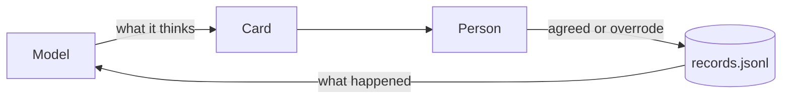

# logbook

**No training set? Let behaviour build one.**

A decision-support product built on an open-weight model usually starts with no labelled data. logbook makes the product collect it. When a conversation reaches a decision, the model replies with a card instead of a paragraph. The card has five fixed parts. The person answers and chooses on it, and a week later the assistant follows up to ask what happened. Every step is logged with the full prompt, as a record you can learn from.


**[Try the demo](https://carlholland93.github.io/logbook/)** in your browser. A stand-in model writes the cards and nothing is installed. To run it against a model on your own machine, see [examples/local-model](examples/local-model/README.md).

## The loop



The card has five parts, and each one comes from something people already do:

| Part | Because people | The card |
|---|---|---|
| Signal | scan for risk | says what it thinks, as a confidence band, not a number |
| Evidence | want the why before trusting it | shows each reason with what it rests on: data, a rule of thumb, or nothing |
| Ask | know things no system records | asks one question, when the answer would change the recommendation |
| Choice | make the call | offers two to four options, one tap each, at most one highlighted |
| Check-in | look back | asks later whether the signal came true |

The last three listen. That is where the training set comes from.

## One record

A real line from `records.jsonl`. It is the conversation in the demo: the store manager asks what to know before ordering, the assistant flags Supplier B, and the manager asks "Supplier B is late again. Should I reorder?" The opening turns are scripted; `qwen2.5:7b` wrote the card. The taps were scripted too, and the follow-up was answered a week later on the demo clock. The instructions to the model are shortened here; the file keeps all of them.

<details open>
<summary>The record, after the check-in closed it</summary>

```json
{
  "schema_version": "0.1",
  "record_id": "c0a5090b-88d4-446d-9596-284d4a908949",
  "card_id": "6925cbad-ec73-486e-ac04-be8cfd82e2dc",
  "status": "closed",
  "created_at": "2026-10-01T02:39:23.756Z",
  "updated_at": "2026-10-08T03:40:22.803Z",
  "actor": {
    "user_hash": "u_3f9a1c07e2b84d55",
    "role": "Store manager"
  },
  "input": {
    "messages": [
      {
        "role": "system",
        "content": "… (3,327 characters)"
      },
      {
        "role": "user",
        "content": "Morning. Anything I should know before I place this week’s orders?"
      },
      {
        "role": "assistant",
        "content": "Two things. Supplier B has been late on each of its last four deliveries, and their lines are down to about five days of stock. Everything else looks normal."
      },
      {
        "role": "user",
        "content": "Input:\n[ctx_1] Supplier B delivery delays on the last four orders: 3, 6, 4, 5 days.\n[ctx_2] Stock on hand covers 5 days at this week's sales rate.\n\nThe store manager asks: Supplier B is late again. Should I reorder?"
      }
    ],
    "template_version": "t3",
    "card_schema_version": "0.1",
    "sampling": {
      "temperature": 0.2,
      "max_tokens": 800
    },
    "retrieval_ids": [
      "ctx_1",
      "ctx_2"
    ],
    "context_hash": "sha256:68663ff6ac464dcf9eafb9a23a5ec8ca1769e692f533cf3bc87fa5b13af847d6",
    "hypothesis": {
      "context": "Weekly stock review",
      "who": "Store manager",
      "what": "a supplier delivery that is likely to be late",
      "what_changes": "reorders placed before stock runs out",
      "by_how_much": "stock-outs down 20% in a quarter"
    }
  },
  "model": {
    "name": "qwen2.5:7b",
    "provider": "openai_compatible",
    "endpoint_hash": "9b514b1a65f6ebfa",
    "version": "sha256:845dbda0ea48ed749caafd9e6037047aa19acfcfd82e704d7ca97d631a0b697e"
  },
  "shown": {
    "card": {
      "kind": "decision",
      "signal": {
        "headline": "Supplier B is likely to be late again",
        "level": "high",
        "confidence": 0.8
      },
      "evidence": [
        {
          "text": "Supplier B has been late on the last four deliveries, each by 3, 6, 4, and 5 days",
          "basis": "data",
          "ref": "ctx_1"
        },
        {
          "text": "Current stock covers 5 days at this week's sales rate",
          "basis": "data",
          "ref": "ctx_2"
        }
      ],
      "choice": {
        "options": [
          {
            "id": "reorder",
            "label": "Place the order now"
          },
          {
            "id": "wait",
            "label": "Wait and see"
          }
        ],
        "recommended": "reorder"
      },
      "check_in": {
        "question": "Did Supplier B deliver on time?",
        "due_in": "P7D",
        "options": [
          {
            "id": "yes",
            "label": "Yes"
          },
          {
            "id": "no",
            "label": "No"
          }
        ],
        "confirms": "no"
      },
      "schema_version": "0.1",
      "card_id": "6925cbad-ec73-486e-ac04-be8cfd82e2dc"
    },
    "highlight_shown": true,
    "latency_ms": 23740,
    "at": "2026-10-01T02:39:23.756Z"
  },
  "chose": {
    "option_id": "wait",
    "recommended_id": "reorder",
    "agreed": false,
    "time_to_choose_ms": 41041,
    "at": "2026-10-01T02:40:04.797Z",
    "override_reason": "Supplier B confirmed a Friday delivery by phone"
  },
  "outcome": {
    "due_at": "2026-10-08T02:40:04.797Z",
    "source": "self",
    "option_id": "yes",
    "at": "2026-10-08T03:40:22.803Z"
  }
}
```

</details>

What to look at:

- **`input.messages`** is the conversation, word for word, not a reference to it: every turn, the facts that were looked up, and the question that reached the decision. References go stale, and without the prompt no record can become a training example.
- **`highlight_shown`** says whether the recommendation was highlighted. One card in ten is shown without it, so a real preference can be told apart from people tapping the highlighted option.
- **`override_reason`** turns an override from one bit into a label. The model said to place the order; the manager waited, because the supplier had confirmed a date.
- **`check_in.confirms`** with **`outcome`** scores the signal. The model saw a high risk of a late delivery, and "no" to "Did Supplier B deliver on time?" would have confirmed it. The manager answered "yes".

## One pair, derived from it

`pnpm -s pairs records.jsonl` turns each choice into pairs: the chosen option against each option not chosen.

```json
{
  "kind": "within_card",
  "record_id": "c0a5090b-88d4-446d-9596-284d4a908949",
  "card_id": "6925cbad-ec73-486e-ac04-be8cfd82e2dc",
  "context_hash": "sha256:68663ff6ac464dcf9eafb9a23a5ec8ca1769e692f533cf3bc87fa5b13af847d6",
  "template_version": "t3",
  "chosen": {
    "id": "wait",
    "label": "Wait and see"
  },
  "rejected": {
    "id": "reorder",
    "label": "Place the order now"
  },
  "recommended_id": "reorder",
  "highlight_shown": true,
  "agreed": false,
  "override_reason": "Supplier B confirmed a Friday delivery by phone",
  "time_to_choose_ms": 41041,
  "status": "closed",
  "repaired": false,
  "signal_confirmed": false
}
```

That is a ranking signal for a small reranker. It is not a preference between two generated cards. Only one card is shown per decision, so the record holds no evidence of that comparison, and the script refuses to invent one.

## What the log is worth, by size

| Records | What you can do |
|---|---|
| 0 | Replay every prompt through a new model or template and compare the cards |
| about 50 | Put agreed cards with good outcomes into the prompt as examples |
| about 200 | Plot confidence against what happened, then calibrate it ([on synthetic records](docs/reliability.svg)) |
| about 1,000 | Predict overrides, and withhold the highlight where people usually override |
| 1,000 clean | Fine-tune on prompt and card, for agreed cards with good outcomes |

## Use it

```tsx
import { createOpenAICompatibleAdapter } from './src/adapters/openai-compatible';
import { Card, useLoop } from './src/react';
import { PostSink } from './src/sinks/post';
import { buildMessages, type ContextItem } from './src/template';
import type { Hypothesis } from './src/types';
import './src/skin/default.css';

const adapter = createOpenAICompatibleAdapter({ baseUrl: 'http://localhost:11434/v1', model: 'qwen2.5:7b' });
const sink = new PostSink('/records');

export function Decision({ hypothesis, facts }: { hypothesis: Hypothesis; facts: ContextItem[] }) {
  const loop = useLoop({ adapter, sink, hypothesis });
  return (
    <>
      <button onClick={() => loop.compose(buildMessages({ hypothesis, items: facts }))}>Build the card</button>
      <Card loop={loop} />
    </>
  );
}
```

Not on npm yet: clone the repository.

```sh
pnpm install
pnpm demo                          # the demo, locally
pnpm example --demo                # against Ollama; see examples/local-model
pnpm test                          # the CI suite
pnpm -s synth 200 1 > records.jsonl
pnpm reliability records.jsonl plot.svg
```

## Built with

- **TypeScript**, strict, for everything: about 5,600 lines including tests. The styling is hand-written **CSS**, with no CSS framework and no component library.
- **React 19** for the reference card: one hook (`useLoop`) and a set of headless components.
- **JSON Schema 2020-12** for the card and record contracts, checked with **Ajv**, the only runtime dependency.
- **Node.js 22** for the example's record server, on the built-in `http` module with no web framework.
- **Vite** for the demo and the example app. **Vitest** with Testing Library for the tests, run on every push by **GitHub Actions**.
- Any **OpenAI-compatible** model endpoint. Developed against **Ollama** running `qwen2.5:7b`.

## Status

Version 1 of the reference implementation. The card and record contracts it implements are version 0.1 and still a draft: a pattern with one reference implementation, not a standard or a protocol. [SPEC.md](SPEC.md) is the full design: the card and record contracts, the state machine, the adapter, and what each field is for. The schemas are in [schema/](schema/).

MIT licence.
